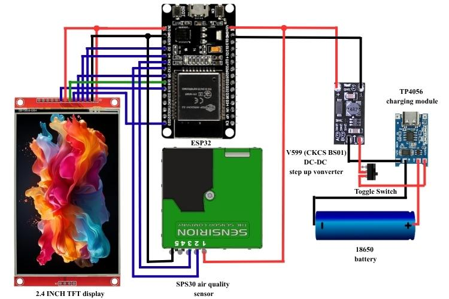
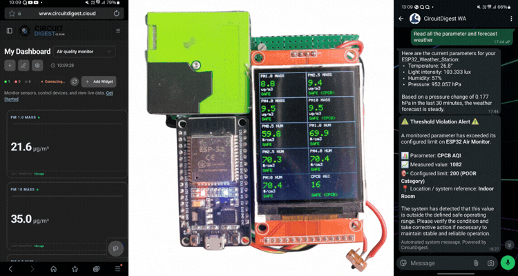

# AI based Air Quality Monitoring using ESP32

[](https://opensource.org/licenses/MIT)
[](https://www.espressif.com/)
[](https://sensirion.com/products/catalog/SPS30/)
[](https://circuitdigest.com/)

An IoT-based **Air Quality Monitoring System** powered by an **ESP32**, **Sensirion SPS30 Optical Particulate Matter Sensor**, **ILI9341 2.4" TFT Display**, and **CircuitDigest Cloud**.

This system measures real-time particulate matter mass concentrations ($\text{PM}_{1.0}$, $\text{PM}_{2.5}$, $\text{PM}_{4.0}$, $\text{PM}_{10}$) and numerical particle counts ($\text{NC}_{0.5}$ to $\text{NC}_{10}$), calculates the **Indian CPCB Air Quality Index (AQI)**, renders a 2x5 portrait dashboard on the TFT display, streams telemetry in dual batches to CircuitDigest Cloud, and dispatches WhatsApp alert notifications when AQI exceeds the CPCB Poor category threshold ($\text{AQI} > 200$).

---

## 🌟 Key Features

- **Sensirion SPS30 Laser PM Sensor**: Measures precise particle mass concentrations ($\mu\text{g/m}^3$) and particle count concentrations (`particles/cm³`) via UART (`Serial2`).
- **Indian CPCB AQI Calculation**: Computes real-time Indian CPCB Air Quality Index from $\text{PM}_{2.5}$ and $\text{PM}_{10}$ sub-indices with standard breakpoint formulas.
- **2x5 Portrait Dashboard Grid (240x320)**: Displays 10 parameter slots on the ILI9341 TFT display with color-coded safety indicators (Green for Safe, Red for Threshold Violation, Yellow for Info Only).
- **Dual-Batch MQTT Cloud Telemetry**: Publishes 10 telemetry variables to CircuitDigest Cloud every 5 seconds in two 5-parameter batches to maximize MQTT throughput.
- **WhatsApp Notification Integration**: Triggers automated HTTP POST WhatsApp alert notifications via CircuitDigest Cloud API when CPCB AQI enters the **POOR** category ($> 200$). State-locking prevents duplicate alert spamming until air quality recovers.
- **Robust Hardware Protection**:
  - **Brownout Detector Disabled**: Prevents system reboots caused by peak battery/power supply voltage dips.
  - **Staged 3-Step Soft-Start**: Sequentially initializes Display (5s pause), SPS30 Sensor Fan (5s pause), and Wi-Fi/Cloud to isolate startup power draw.
  - **Wi-Fi Auto-Reboot Handler**: Auto-restarts system on Wi-Fi loss for a clean staged reconnection sequence.

---

## 📊 CPCB Air Quality Index Categories

| AQI Range | Category | Color Indicator | Action / Warning Level |
| :---: | :---: | :---: | :--- |
| **0 – 50** | Good | Green | Minimal Impact |
| **51 – 100** | Satisfactory | Green | Minor breathing discomfort to sensitive people |
| **101 – 200** | Moderate | Yellow | Breathing discomfort to people with lungs, asthma, and heart diseases |
| **201 – 300** | Poor | Red | Breathing discomfort to most people on prolonged exposure **(WhatsApp Alert Triggered)** |
| **301 – 400** | Very Poor | Red | Respiratory illness on prolonged exposure |
| **401 – 500+**| Severe | Red | Affects healthy people and seriously impacts those with existing diseases |

---

## 🛠️ Hardware Requirements & Pinout

| Component | Quantity | Connection / Pin Mapping |
| :--- | :---: | :--- |
| **ESP32 Dev Board** | 1 | Microcontroller (Dual-core Wi-Fi + Bluetooth SoC) |
| **Sensirion SPS30** | 1 | Optical Dust / PM Sensor (`TX` -> GPIO 16 `RX2`, `RX` -> GPIO 17 `TX2`, 5V, GND) |
| **ILI9341 TFT Display** | 1 | 2.4" SPI Color Display (`CS` -> GPIO 2, `DC` -> GPIO 5, `RST` -> GPIO 4, SPI Pins) |
| **5V Power Supply** | 1 | 5V / 2A Power Adapter |

```
[ Sensirion SPS30 ]        [ ESP32 Dev Board ]        [ ILI9341 TFT Display ]
  VCC -----------------------> 5V
                               3.3V ---------------------> VCC / LED
  GND -----------------------> GND ----------------------> GND
  TX ------------------------> GPIO 16 (RX2)
  RX ------------------------> GPIO 17 (TX2)
                               GPIO 2 -------------------> CS
                               GPIO 5 -------------------> DC
                               GPIO 4 -------------------> RESET
                               GPIO 23 (MOSI) -----------> SDI / MOSI
                               GPIO 18 (SCK) ------------> SCK / CLK
```

---

## ☁️ CircuitDigest Cloud Variable Mapping

The system publishes 10 parameters to CircuitDigest Cloud in two batches:

| Key | Variable | Unit | Description |
| :--- | :--- | :---: | :--- |
| `analog-input-1` | `KEY_PM1_0_MASS` | $\mu\text{g/m}^3$ | $\text{PM}_{1.0}$ Mass Concentration |
| `analog-input-2` | `KEY_PM2_5_MASS` | $\mu\text{g/m}^3$ | $\text{PM}_{2.5}$ Mass Concentration |
| `analog-input-3` | `KEY_PM4_0_MASS` | $\mu\text{g/m}^3$ | $\text{PM}_{4.0}$ Mass Concentration |
| `analog-input-4` | `KEY_PM10_MASS`  | $\mu\text{g/m}^3$ | $\text{PM}_{10}$ Mass Concentration |
| `analog-input-5` | `KEY_PM0_5_NUM`  | particles/cm³ | $\text{NC}_{0.5}$ Number Concentration |
| `analog-input-6` | `KEY_PM1_0_NUM`  | particles/cm³ | $\text{NC}_{1.0}$ Number Concentration |
| `analog-input-7` | `KEY_PM2_5_NUM`  | particles/cm³ | $\text{NC}_{2.5}$ Number Concentration |
| `analog-input-8` | `KEY_PM4_0_NUM`  | particles/cm³ | $\text{NC}_{4.0}$ Number Concentration |
| `analog-input-9` | `KEY_PM10_NUM`   | particles/cm³ | $\text{NC}_{10}$ Number Concentration |
| `analog-input-10`| `KEY_AQI`        | AQI Index | Indian CPCB AQI Value |

---

## 🖼️ Circuit & Hardware Setup

### Wiring Diagram


---

## 📸 Output & Dashboard Demo

### Hardware Output


---

## 📁 Repository Structure

```
air-quality-monitor/
├── code/
│   └── airqualitymonitor/
│       └── airqualitymonitor.ino   # Main ESP32 Arduino sketch
├── docs/
│   ├── images/
│   │   ├── Output-display.gif      # Hardware & TFT Display Animated Demo
│   │   └── Wiring-Diagram.jpg      # Circuit Wiring Diagram Image
│   └── setup_guide.md              # Detailed wiring & cloud setup guide
├── LICENSE                         # MIT Open-Source License
└── README.md                       # Main Project Documentation
```

---

## 🚀 Getting Started

### 1. Software & Dependencies

Install [Arduino IDE](https://www.arduino.cc/en/software) (v2.0+) and add the ESP32 board manager URL.

Required Arduino Libraries:
- **Adafruit GFX Library** (`Adafruit_GFX.h`)
- **Adafruit ILI9341** (`Adafruit_ILI9341.h`)
- **Sensirion UART SPS30** (`SensirionUartSps30.h`)
- **CircuitDigestCloud** (`CircuitDigestCloud.h`)

### 2. Configuration

Open [`code/airqualitymonitor/airqualitymonitor.ino`](file:///d:/CIRCUIT%20DIGEST/github/air-quality-monitor/code/airqualitymonitor/airqualitymonitor.ino) and update placeholders with your actual network and cloud credentials:

```cpp
#define WIFI_SSID      "your-Wi-Fi SSID"       // Your Wi-Fi network name
#define WIFI_PASS      "your-Wi-Fi password"   // Your Wi-Fi password
#define DEVICE_ID      "your-device-id"        // CircuitDigest Cloud Device ID
#define CONNECTION_KEY "your-connection-key"   // CircuitDigest Cloud Connection Key
#define API_KEY        "your-api-key"          // CircuitDigest Cloud API Key

#define WHATSAPP_PHONE "your-registered-phone-number" // Linked WhatsApp phone number
```

### 3. Compilation & Flashing

1. Connect ESP32 via USB.
2. Select Board: **ESP32 Dev Module**.
3. Select COM Port.
4. Click **Upload**.
5. Open Serial Monitor at `115200` baud rate to view startup diagnostics and soft-start sequence log messages.

---

## 📄 Documentation

For full setup guidelines including CPCB sub-index formulas and CircuitDigest Cloud setup, see the [Setup Guide](docs/setup_guide.md).

---

## 📜 License

This project is licensed under the [MIT License](LICENSE).
